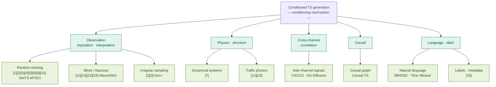
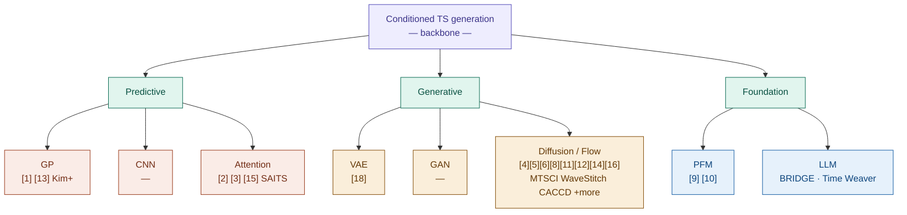

# Awesome Conditioned Time Series Generation

> A curated list of resources for conditioned time series generation, organized by **conditioning mechanism** (what signal guides generation) with backbone architecture as secondary metadata on each entry.

The conditioning problem is the more fundamental organizing question: the same backbone (e.g. diffusion) appears across nearly every conditioning type. This list makes that structure explicit.

---

## Contents

- [Taxonomy](#taxonomy)
- [1. Observation-Conditioned Generation](#1-observation-conditioned-generation)
- [2. Physics & Structure-Conditioned Generation](#2-physics--structure-conditioned-generation)
- [3. Cross-Channel & Correlation-Conditioned Generation](#3-cross-channel--correlation-conditioned-generation)
- [4. Causal-Conditioned Generation](#4-causal-conditioned-generation)
- [5. Language & Label-Conditioned Generation](#5-language--label-conditioned-generation)
- [Applications](#applications)
- [Related Works & Backbone Baselines](#related-works--backbone-baselines)
- [Datasets](#datasets)
- [Evaluation Metrics](#evaluation-metrics)
- [Surveys](#surveys)
- [Related Awesome Lists](#related-awesome-lists)
- [License](#license)

---

## Taxonomy

Papers are organized by **conditioning mechanism** (primary) with **backbone** noted per entry. The two diagrams below show both axes.

### By conditioning mechanism

### By backbone architecture [Jiaqi+] 

Diffusion dominates across all conditioning types. This diagram reflects the backbone distribution of the papers in this list.

---

## 1. Observation-Conditioned Generation

The most studied conditioning type: generating missing or unobserved values conditioned on what is observed. Covers random, block/blackout, and irregular-sampling missingness patterns.

### GP-Based

- **[1] GP-VAE: Deep probabilistic time series imputation.**
  Fortuin, Vincent, et al. International Conference on Artificial Intelligence and Statistics. PMLR.
  2020 | [Paper](https://proceedings.mlr.press/v108/fortuin20a/fortuin20a.pdf) | [Code](https://github.com/ratschlab/GP-VAE)
  - *Backbone*: GP prior + VAE | *Conditioning*: observed values as context | *Missing pattern*: random

- **[Kim+] Probabilistic imputation for time-series classification with missing data.**
  Kim, SeungHyun, et al. International Conference on Machine Learning. PMLR.
  2023 | [Paper](https://proceedings.mlr.press/v202/kim23m/kim23m.pdf)
  - *Backbone*: GP | *Conditioning*: observed values + downstream classification signal | *Missing pattern*: random

### VAE / Encoder-Decoder

- **[2] HetVAE: Heteroscedastic temporal variational autoencoder for irregularly sampled time series.**
  Shukla, Satya Narayan, and Benjamin Marlin. ICLR.
  2022 | [Paper](https://openreview.net/pdf?id=Az7opqbQE-3) | [Code](https://github.com/reml-lab/hetvae)
  - *Backbone*: VAE | *Conditioning*: irregular observation times and values | *Missing pattern*: irregular sampling

- **[3] Tripletformer: Probabilistic interpolation of irregularly sampled time series.**
  Yalavarthi, Vijaya Krishna, et al. IEEE International Conference on Big Data. IEEE.
  2023 | [Paper](https://arxiv.org/pdf/2210.02091) | [Code](https://github.com/yalavarthivk/tripletformer)
  - *Backbone*: Transformer | *Conditioning*: triplet (time, value, mask) observations | *Missing pattern*: irregular sampling

### Diffusion / Flow-Based

- **[4] CSDI: Conditional score-based diffusion models for probabilistic time series imputation.**
  Tashiro, Yusuke, et al. NeurIPS.
  2021 | [Paper](https://proceedings.neurips.cc/paper_files/paper/2021/file/cfe8504bda37b575c70ee1a8276f3486-Paper.pdf) | [Code](https://github.com/ermongroup/CSDI)
  - *Backbone*: Diffusion (score-based) | *Conditioning*: observed values via masking | *Missing pattern*: random

- **[5] SSSD: Diffusion-based time series imputation and forecasting with structured state space models.**
  Lopez Alcaraz, Juan Miguel, and Nils Strodthoff. Transactions on Machine Learning Research.
  2022 | [Paper](https://arxiv.org/abs/2208.09399) | [Code](https://github.com/AI4HealthUOL/SSSD)
  - *Backbone*: Diffusion + S4 | *Conditioning*: observed values | *Missing pattern*: random

- **[6] SSD-TS: Exploring the potential of linear state space models for diffusion models in time series imputation.**
  Gao, Hongfan, et al. ACM SIGKDD.
  2025 | [Paper](https://arxiv.org/abs/2410.13338) | [Code](https://github.com/decisionintelligence/SSD-TS)
  - *Backbone*: Diffusion + linear SSM | *Conditioning*: observed values | *Missing pattern*: random

- **[8] FM-TS (FlowTS): Flow matching for time series generation.**
  Hu, Y., et al.
  2024 | [Paper](https://arxiv.org/abs/2411.07506) | [Code](https://github.com/UNITES-Lab/FlowTS)
  - *Backbone*: Flow matching | *Conditioning*: observed values | *Missing pattern*: random / unconditional

- **MTSCI: A conditional diffusion model for multivariate time series consistent imputation.**
  Wang, Xin, et al.
  2023 | [Paper](https://arxiv.org/pdf/2408.05740)
  - *Backbone*: Diffusion | *Conditioning*: observed values with inter-variable consistency constraints | *Missing pattern*: random

- **WaveStitch: Flexible and fast conditional time series generation with diffusion models.**
  2025 | [Paper](https://dl.acm.org/doi/pdf/10.1145/3769842)
  - *Backbone*: Diffusion | *Conditioning*: partial observations | *Missing pattern*: block / random

- **Schrödinger bridge: Provably convergent Schrödinger bridge with applications to probabilistic time series imputation.**
  Chen, Yuguang, et al. ICML.
  2023 | [Paper](https://arxiv.org/pdf/2305.07247)
  - *Backbone*: Schrödinger bridge (diffusion-adjacent) | *Conditioning*: observed endpoints | *Missing pattern*: random

### Attention / Foundation-Based

- **SAITS: Self-attention-based imputation for time series.**
  Du, Wenjie, David Cote, and Yan Liu. Expert Systems with Applications.
  2023 | [Paper](https://arxiv.org/abs/2202.08516) | [Code](https://github.com/WenjieDu/SAITS)
  - *Backbone*: Transformer (diagonally masked attention) | *Conditioning*: observed values | *Missing pattern*: random

- **[9] NuwaTS: A foundation model mending every incomplete time series.**
  Cheng, Jinguo, et al. arXiv.
  2024 | [Paper](https://arxiv.org/abs/2405.15317) | [Code](https://github.com/Chengyui/NuwaTS)
  - *Backbone*: Foundation model (GPT-style) | *Conditioning*: observed patches | *Missing pattern*: random / block

- **[10] Are time-indexed foundation models the future of time series imputation?**
  Le Naour, Etienne, et al. arXiv.
  2024 | [Paper](https://arxiv.org/abs/2511.05980)
  - *Backbone*: Time-indexed foundation model | *Conditioning*: observed values | *Missing pattern*: random

- **ST-MVL: Filling missing values in geo-sensory time series data.**
  Yi, Xiuwen, et al. IJCAI.
  2016 | [Paper](https://www.ijcai.org/Proceedings/16/Papers/384.pdf)
  - *Backbone*: Spatial-temporal multi-view learning | *Conditioning*: spatial neighbors + temporal context | *Missing pattern*: spatial / random

---

## 2. Physics & Structure-Conditioned Generation

Generation conditioned on physical laws, dynamical system equations, or structural domain constraints — beyond observed values alone.

- **[7] Reconstructing dynamics from sparse observations with no training on target system.**
  Zhai, Z. M., et al. Nature Communications.
  2024 | [Paper](https://arxiv.org/pdf/2410.21222) | [Code](https://github.com/Zheng-Meng/Dynamics-Reconstruction-ML)
  - *Backbone*: ML-based dynamics reconstruction | *Conditioning*: sparse observations + dynamical system structure

- **[12] PMA-Diffusion: A physics-guided mask-aware diffusion framework for traffic state estimation.**
  Liu, Lindong, et al. arXiv.
  2025 | [Paper](https://arxiv.org/abs/2512.06183)
  - *Backbone*: Diffusion (UNet) | *Conditioning*: physics constraints + sparse loop detector / probe vehicle data

- **[13] Traffic state estimation from vehicle trajectories with anisotropic Gaussian processes.**
  Wu, F., et al. Transportation Research Part C.
  2024 | [Paper](https://www.sciencedirect.com/science/article/pii/S0968090X24001670) | [Code](https://github.com/Lucky-Fan/GP_TSE)
  - *Backbone*: GP | *Conditioning*: sparse vehicle trajectories + anisotropic spatial structure

---

## 3. Cross-Channel & Correlation-Conditioned Generation

Generation that explicitly conditions on inter-channel dependencies or distributional style of a reference dataset.

- **CACCD: Channel-aware contrastive conditional diffusion for multivariate probabilistic time series forecasting.**
  2024 | [Paper](https://arxiv.org/pdf/2410.02168)
  - *Backbone*: Diffusion | *Conditioning*: cross-channel contrastive signals

- **DS-Diffusion: Data style-guided diffusion model for time-series generation.**
  2025 | [Paper](https://arxiv.org/pdf/2509.18584)
  - *Backbone*: Diffusion | *Conditioning*: style / distribution of a reference dataset

---

## 4. Causal-Conditioned Generation

Generation conditioned on or constrained to respect a causal graph structure between variables.

- **Causal-TS: Causal time series generation via diffusion models.**
  2025 | [Paper](https://arxiv.org/pdf/2509.20846)
  - *Backbone*: Diffusion | *Conditioning*: causal graph structure over variables

---

## 5. Language & Label-Conditioned Generation

Generation guided by natural language descriptions, class labels, metadata, or demographic signals.

- **BRIDGE: Bootstrapping text to control time-series generation via multi-agent iterative optimization and diffusion modeling.**
  Chen, Yiyuan, et al. arXiv.
  2024 | [Paper](https://arxiv.org/pdf/2503.02445)
  - *Backbone*: Diffusion | *Conditioning*: natural language descriptions

- **Time Weaver: A conditional time series generation model.**
  2025 | [Paper](https://arxiv.org/pdf/2403.02682)
  - *Backbone*: Diffusion | *Conditioning*: multi-type (text, metadata, demographics)

---

## Applications

Domain-specific applications. Papers here also appear in a Methods section above; entries here focus on the applied problem and task.

### Healthcare & Medical

- **[11] MED-Diffusion: Diffusion model-based imputation of multimodal sensor data for surgical patients.**
  Cheng, Z., et al. Sensors.
  2025 | [Paper](https://www.mdpi.com/1424-8220/25/19/6175)
  - *Backbone*: Diffusion (UNet) + tokenization | *Conditioning*: observation (random + block missing)
  - *Task*: Surgical patient monitoring with multimodal sensors

### Transportation & Traffic

- **[12] PMA-Diffusion: Physics-guided mask-aware diffusion for traffic state estimation.**
  Liu, Lindong, et al. arXiv.
  2025 | [Paper](https://arxiv.org/abs/2512.06183)
  - *Backbone*: Diffusion | *Conditioning*: physics + sparse observations
  - *Task*: Highway traffic state estimation from sparse loop detectors and probe vehicles

- **[13] Traffic state estimation from vehicle trajectories with anisotropic Gaussian processes.**
  Wu, F., et al. Transportation Research Part C.
  2024 | [Paper](https://www.sciencedirect.com/science/article/pii/S0968090X24001670) | [Code](https://github.com/Lucky-Fan/GP_TSE)
  - *Backbone*: GP | *Conditioning*: physics + sparse trajectories
  - *Task*: Reconstruct traffic state from sparse vehicle trajectories

### Industrial & IoT

- **[14] Lightweight window-portion-based multiple imputation for extreme missing gaps in IoT systems.**
  Adhikari, D., et al. IEEE Internet of Things Journal.
  2024 | [Paper](https://ieeexplore.ieee.org/document/10250789)
  - *Backbone*: LGBM regression | *Conditioning*: observation (extreme block missing)
  - *Task*: Recovery from sensor failure, network instability, power loss in IoT data

- **[15] Blackout missing data recovery in industrial time series.**
  Liu, D., et al. IEEE Transactions on Automation Science and Engineering.
  2023 | [Paper](https://ieeexplore.ieee.org/abstract/document/10163894)
  - *Backbone*: Conv + Transformer encoder | *Conditioning*: observation (blackout / block missing)
  - *Task*: Industrial TS recovery from hardware failures and maintenance downtime

- **[16] Quality aware industrial data imputation with self-supervised recovery.**
  Dai, Yun, et al. Computers & Chemical Engineering.
  2025 | [Paper](https://www.sciencedirect.com/science/article/abs/pii/S0098135425003308)
  - *Backbone*: CSDI + LSTM quality head | *Conditioning*: observation + downstream quality label
  - *Task*: Soft sensor development in chemical manufacturing

### Climate & Weather

- **[17] Generative data assimilation of sparse weather station observations at kilometre scales.**
  2025 | [Paper](https://arxiv.org/pdf/2406.16947)
  - *Backbone*: unconditional diffusion + Score-Based Data Assimilation (SDA) (+ Learnt Physics via Multivariate Relationships)| *Conditioning*: Observations (reg adn irreg grid sampling)
  - *Task*: generate detailed maps of precipitation and surface winds that are consistent with sparse ground-based weather station observations.

### Aviation

- **[18] Deep generative modelling of aircraft trajectories in terminal manoeuvring areas.**
  Krauth, Timothé, et al. Machine Learning with Applications.
  2023 | [Paper](https://www.sciencedirect.com/science/article/pii/S2666827022001219) | [Code](https://github.com/kruuZHAW/deep-traffic-generation-paper)
  - *Backbone*: VAE + TCN + VampPrior | *Conditioning*: latent / few-shot trajectory prior
  - *Task*: Realistic trajectory generation in terminal manoeuvre areas with limited data

---

## Related Works & Backbone Baselines

Unconditional or latent-conditioned generative models not directly covered by this list, included as backbone baselines and for comparison.

- **Diffusion-TS: Interpretable diffusion for general time series generation.**
  Yuan, Yuan, et al. ICLR.
  2024 | [Paper](https://arxiv.org/abs/2403.01742) | [Code](https://github.com/Y-debug-sys/Diffusion-TS)
  - *Backbone*: Diffusion | *Note*: unconditional; commonly used as a generation baseline

- **TransFusion: Generating long, high fidelity time series using diffusion models with transformers.**
  Alcaraz, Juan Miguel Lopez, and Nils Strodthoff. arXiv.
  2024 | [Paper](https://arxiv.org/abs/2307.12667)
  - *Backbone*: Diffusion + Transformer | *Note*: unconditional; baseline for long-horizon generation

- **TIMER-XL: Long-context transformers for unified time series forecasting.**
  Cao, Yong, et al. arXiv.
  2024 | [Paper](https://arxiv.org/abs/2410.04803)
  - *Backbone*: Transformer | *Note*: forecasting model; conditioning is implicit (history window)

---

## Datasets

A curated set of datasets spanning healthcare, traffic, energy, climate, finance, and synthetic benchmarks. Entries include dimensions, sequence length, native and experimental missing rates, and which papers use each dataset.

See **[DATASETS.md](DATASETS.md)** for the full dataset reference table.

---

## Evaluation Metrics

| Metric | Category | Purpose | Key Papers |
|---|---|---|---|
| MSE / MAE / RMSE | Point-wise | Reconstruction accuracy | Most |
| MRE | Point-wise | Normalized error | [1],[4],[6] |
| CRPS | Probabilistic | Full predictive distribution quality | [1],[2],[4],[5],[6] |
| Quantile Loss | Probabilistic | Calibration at specific quantiles | [4],[5],[6] |
| NLL | Probabilistic | Log-likelihood of ground truth | [1],[2],[4] |
| Discriminative Score | Generative | Real vs. synthetic classifier (lower = better) | [8],[9] |
| Predictive Score | Generative | Train-on-synthetic, test-on-real | [8],[9] |
| Context-FID | Generative | Fréchet distance in feature space | [8] |
| Correlational Score | Generative | Temporal dependency preservation | [8] |

---

## Surveys

- [Jiaqi+] **Deep learning for multivariate time series imputation: A survey.**
  Ma, Jiaqi, et al. arXiv.
  2024 | [Paper](https://arxiv.org/abs/2402.04059)

---

## Related Awesome Lists

- [Awesome Time Series](https://github.com/cuge1995/awesome-time-series)
- [Awesome Deep Learning for Time Series](https://github.com/Alro10/deep-learning-time-series)
- [Awesome Diffusion Models](https://github.com/diff-usion/Awesome-Diffusion-Models)

---

## License

